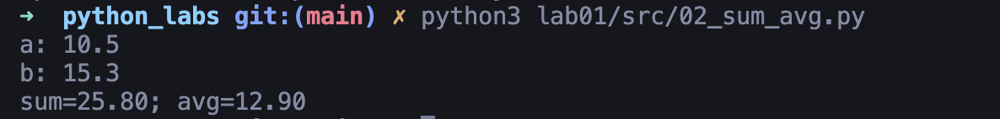

# Лабораторная работа № 1

В этой папке собраны решения задач. Каждая программа — отдельный файл внутри директории `src/`

## Список заданий

### `01_greeting.py`

Программа спрашивает имя и возраст пользователя
Проверяет корректность ввода: имя не должно быть пустым и содержать цифры, возраст — целое число в диапазоне от 0 до 150
После ввода выводит приветствие и возраст через год

Пример:

```
Имя: Алексей
Возраст: 20
Привет, Алексей! Через год тебе будет 21.
```

```python
from decimal import InvalidOperation
from typing import Optional


def is_valid_integer_string(input_string: str) -> bool:
    """Проверяет, является ли строка корректным целым числом (без пробелов, запятых и точек)"""
    cleaned = input_string.strip()
    if not cleaned:
        return False
    if cleaned.startswith('-'):
        cleaned = cleaned[1:]
    return cleaned.isdigit()


def parse_integer_string(number_string: str) -> Optional[int]:
    """Парсит строку в int, возвращает None при ошибке"""
    try:
        return int(number_string.strip())
    except (ValueError, InvalidOperation):
        return None


def get_valid_integer(prompt: str, min_value: int = 0, max_value: int = 150) -> int:
    """Получает и валидирует ввод целого числа с повторными попытками"""
    while True:
        try:
            user_input = input(prompt)

            if not is_valid_integer_string(user_input):
                raise ValueError("Возраст должен быть целым числом (без запятых и точек)")

            number = parse_integer_string(user_input)
            if number is None:
                raise ValueError("Не удалось преобразовать в число")

            if number < min_value:
                raise ValueError(f"Возраст не может быть меньше {min_value}")
            if number > max_value:
                raise ValueError(f"Возраст не может быть больше {max_value}")

            return number

        except ValueError as e:
            print(f"Ошибка: {e}")
        except Exception as e:
            print(f"Неожиданная ошибка: {e}. Попробуйте ещё раз")


def get_valid_name(prompt: str) -> str:
    """Получает и валидирует имя (только буквы, минимум 1 символ)"""
    while True:
        name = input(prompt).strip()
        if not name:
            print("Ошибка: имя не может быть пустым")
            continue
        if any(ch.isdigit() for ch in name):
            print("Ошибка: имя не должно содержать цифры")
            continue
        return name


def main() -> None:
    name = get_valid_name("Имя: ")
    age = get_valid_integer("Возраст: ")
    print(f"Привет, {name}! Через год тебе будет {age + 1}.")


if __name__ == "__main__":
    main()
```


---

### `02_sum_avg.py`

Программа запрашивает два числа с плавающей точкой и вычисляет их сумму и среднее арифметическое
Результат выводится с двумя знаками после запятой

Пример:

```
a: 10.5
b: 15.3
sum=25.80; avg=12.90
```

```python
from decimal import Decimal, InvalidOperation
from typing import Tuple, Optional


def is_valid_number_string(input_string: str) -> bool:
    """Проверяет, является ли строка корректным числом"""
    cleaned_string = input_string.strip()
    
    if not cleaned_string:
        return False
    
    if cleaned_string.startswith('-'):
        cleaned_string = cleaned_string[1:]
    
    cleaned_string = cleaned_string.replace(',', '.')
    
    if not cleaned_string.replace('.', '').isdigit():
        return False
    
    if cleaned_string.count('.') > 1:
        return False
    
    if cleaned_string.startswith('.') or cleaned_string.endswith('.'):
        return False
    
    return True


def parse_number_string(number_string: str) -> Optional[Decimal]:
    """Парсит строку в Decimal, возвращает None при ошибке"""
    try:
        normalized_string = number_string.strip().replace(',', '.')
        return Decimal(normalized_string)
    except (InvalidOperation, ValueError):
        return None


def get_valid_number(prompt: str) -> Decimal:
    """Получает и валидирует ввод числа с повторными попытками"""
    while True:
        try:
            user_input = input(prompt)
            
            if not is_valid_number_string(user_input):
                raise ValueError("Некорректный формат числа. Используйте формат '123.45' или '123,45'")
            
            number = parse_number_string(user_input)
            if number is None:
                raise ValueError("Не удалось преобразовать в число")
                
            return number
        
        except ValueError as e:
            print(f"Ошибка: {e}")
        except Exception as e:
            print(f"Неожиданная ошибка: {e}. Попробуйте еще раз")


def calculate_sum_and_avg(num1: Decimal, num2: Decimal) -> Tuple[Decimal, Decimal]:
    """Вычисляет сумму и среднее арифметическое двух чисел"""
    total = num1 + num2
    average = total / Decimal('2')
    return total, average


def format_result(total: Decimal, average: Decimal) -> str:
    """Форматирует результат для вывода с двумя знаками после запятой"""
    return f"sum={total:.2f}; avg={average:.2f}"


def main() -> None:    
    num1 = get_valid_number("a: ")
    num2 = get_valid_number("b: ")
    
    total, average = calculate_sum_and_avg(num1, num2)
    
    result = format_result(total, average)
    print(result)


if __name__ == "__main__":
    main()
```


---

### `03_discount_vat.py`

Вводятся три числа с плавающей точкой:

- `price` — цена в рублях
- `discount` — скидка в процентах
- `vat` — ставка НДС в процентах

Программа считает:

```
base = price * (1 - discount/100)
vat_amount = base * (vat/100)
total = base + vat_amount
```

Результат печатается с двумя знаками после запятой

Пример:

```
Введите цену (₽): 1000
Введите скидку (%): 10
Введите НДС (%): 20
База после скидки: 900.00 ₽
НДС: 180.00 ₽
Итого к оплате: 1080.00 ₽
```

```python
from decimal import Decimal, InvalidOperation
from typing import Optional


def is_valid_number_string(input_string: str) -> bool:
    """Проверяет, является ли строка корректным числом"""
    cleaned = input_string.strip().replace(',', '.')
    if not cleaned:
        return False
    if cleaned.startswith('-'):
        cleaned = cleaned[1:]
    if cleaned.count('.') > 1:
        return False
    if not cleaned.replace('.', '').isdigit():
        return False
    return True


def parse_number_string(number_string: str) -> Optional[Decimal]:
    """Парсит строку в Decimal, возвращает None при ошибке"""
    try:
        normalized = number_string.strip().replace(',', '.')
        return Decimal(normalized)
    except (InvalidOperation, ValueError):
        return None


def get_valid_decimal(prompt: str) -> Decimal:
    """Запрашивает вещественное число, пока не введут корректное"""
    while True:
        try:
            user_input = input(prompt)
            if not is_valid_number_string(user_input):
                raise ValueError("Некорректный формат числа (допустимы только цифры и десятичная точка/запятая)")
            number = parse_number_string(user_input)
            if number is None:
                raise ValueError("Не удалось преобразовать в число")
            if number < 0:
                raise ValueError("Число не может быть отрицательным")
            return number
        except ValueError as e:
            print(f"Ошибка: {e}")
        except Exception as e:
            print(f"Неожиданная ошибка: {e}. Попробуйте ещё раз")


def main() -> None:
    price = get_valid_decimal("Введите цену (₽): ")
    discount = get_valid_decimal("Введите скидку (%): ")
    vat = get_valid_decimal("Введите НДС (%): ")

    base = price * (Decimal('1') - discount / Decimal('100'))
    vat_amount = base * (vat / Decimal('100'))
    total = base + vat_amount

    print(f"База после скидки: {base:.2f} ₽")
    print(f"НДС:               {vat_amount:.2f} ₽")
    print(f"Итого к оплате:    {total:.2f} ₽")


if __name__ == "__main__":
    main()
```


---

### `04_minutes_to_hhmm.py`

Программа переводит минуты в формат `ЧЧ:ММ`
Ввод: целое неотрицательное число минут
Вывод: часы и минуты, где минуты всегда печатаются двумя цифрами

Пример:

```
Минуты: 135
2:15
```

```python
from typing import Optional


def is_valid_integer_string(input_string: str) -> bool:
    """Проверяет, является ли строка корректным целым числом"""
    cleaned = input_string.strip()
    if not cleaned:
        return False
    if cleaned.startswith('-'):
        return False
    return cleaned.isdigit()


def parse_integer_string(number_string: str) -> Optional[int]:
    """Парсит строку в int, возвращает None при ошибке"""
    try:
        return int(number_string.strip())
    except ValueError:
        return None


def get_valid_minutes(prompt: str) -> int:
    """Получает и валидирует количество минут"""
    while True:
        user_input = input(prompt)
        if not is_valid_integer_string(user_input):
            print("Ошибка: нужно ввести целое неотрицательное число минут")
            continue

        minutes = parse_integer_string(user_input)
        if minutes is None:
            print("Ошибка: не удалось преобразовать в число")
            continue

        return minutes


def main() -> None:
    minutes = get_valid_minutes("Минуты: ")
    hours = minutes // 60
    mins = minutes % 60
    print(f"{hours}:{mins:02d}")


if __name__ == "__main__":
    main()

```


---

### `05_initials_and_len.py`

Программа запрашивает ФИО (минимум два слова) и выводит:

- Инициалы в верхнем регистре
- Общую длину строки (количество символов)

Пример:

```
ФИО: Иванов Петр Сидорович
Инициалы: ИПС.
Длина (символов): 19
```

```python
from typing import List


def get_valid_full_name(prompt: str) -> str:
    """Запрашивает ФИО и проверяет, что введено хотя бы два слова"""
    while True:
        full_name = input(prompt)
        if not full_name.strip():
            print("Ошибка: ввод не может быть пустым")
            continue

        parts: List[str] = full_name.split()
        if len(parts) < 2:
            print("Ошибка: требуется минимум два слова (Фамилия и Имя)")
            continue

        return full_name


def build_initials(parts: List[str]) -> str:
    """Формирует инициалы в верхнем регистре из списка слов"""
    initials = "".join(word[0].upper() for word in parts) + "."
    return initials


def main() -> None:
    full_name = get_valid_full_name("ФИО: ")
    trimmed = full_name.strip()
    length = len(trimmed)

    parts = trimmed.split()
    initials = build_initials(parts)

    print(f"Инициалы: {initials}")
    print(f"Длина (символов): {length}")


if __name__ == "__main__":
    main()

```


---

### `06_count_participants.py`

Программа считает участников лабораторной по формату участия

Ввод:

- Сначала число `N` — количество участников
- Далее `N` строк формата:

```
Фамилия Имя Возраст Формат_участия
```

где `Формат_участия` — `True` (очный) или `False` (заочный)

Вывод: два числа через пробел — количество очных и заочных участников

Пример:

```
3
Максимов Максим 18 True
Геннадьев Геннадий 17 False
Алексеев Алексей 17 True
```

```
2 1
```

```python
from typing import Tuple


def parse_participant(line: str) -> Tuple[str, str, int, bool]:
    """
    Разбирает строку участника вида:
    Фамилия Имя Возраст Формат_участия
    Возвращает кортеж (фамилия, имя, возраст, формат).
    """
    parts = line.strip().split()
    if len(parts) != 4:
        raise ValueError(f"Некорректный формат строки: {line}")

    last_name, first_name, age_str, format_str = parts

    if not age_str.isdigit():
        raise ValueError(f"Возраст должен быть целым числом: {age_str}")
    age = int(age_str)

    if format_str not in ("True", "False"):
        raise ValueError(f"Формат участия должен быть 'True' или 'False', а получено: {format_str}")
    is_fulltime = format_str == "True"

    return last_name, first_name, age, is_fulltime


def main() -> None:
    n_str = input().strip()
    if not n_str.isdigit():
        raise ValueError("Первое значение должно быть целым числом")
    n = int(n_str)

    fulltime_count = 0
    parttime_count = 0

    for _ in range(n):
        participant_line = input()
        _, _, _, is_fulltime = parse_participant(participant_line)
        if is_fulltime:
            fulltime_count += 1
        else:
            parttime_count += 1

    print(fulltime_count, parttime_count)


if __name__ == "__main__":
    main()

```


---

### `07_restore_string.py`

Восстановление зашифрованной строки по алгоритму:

1. Первая заглавная буква в исходной строке — начало оригинала
2. Второй символ идёт сразу после цифры
3. Остальные символы идут с фиксированным шагом
4. Последний символ всегда `.`

Пример:

```
thisisabracadabraHt1eadljjl12ojh.
```

```
Hello.
```

```python
def restore_string(s: str) -> str:
    start_idx = None
    for i, ch in enumerate(s):
        if ch.isupper():
            start_idx = i
            break
    if start_idx is None:
        raise ValueError("Не найдена заглавная буква")

    second_idx = None
    for i, ch in enumerate(s[:-1]):
        if ch.isdigit():
            second_idx = i + 1
            break
    if second_idx is None:
        raise ValueError("Не найдена цифра для второго символа")

    step = second_idx - start_idx
    if step <= 0:
        raise ValueError("Некорректный шаг")

    result = []
    i = start_idx
    while i < len(s):
        result.append(s[i])
        if s[i] == '.':
            break
        i += step

    return "".join(result)


def main():
    s = input().strip()
    print(restore_string(s))


if __name__ == "__main__":
    main()
```


---

## Запуск

Все программы на Python
Запускаются командой:

```bash
python src/<имя_файла>.py
```

Например:

```bash
python src/04_minutes_to_hhmm.py
```

---

## Лицензия <a name="license"></a>

[](https://creativecommons.org/licenses/by-nc-sa/4.0/)
Проект доступен с открытым исходным кодом на условиях [Лицензии CC BY-NC-SA 4.0](./LICENSE).

_Авторские права 2025 Андрей Казарин_
