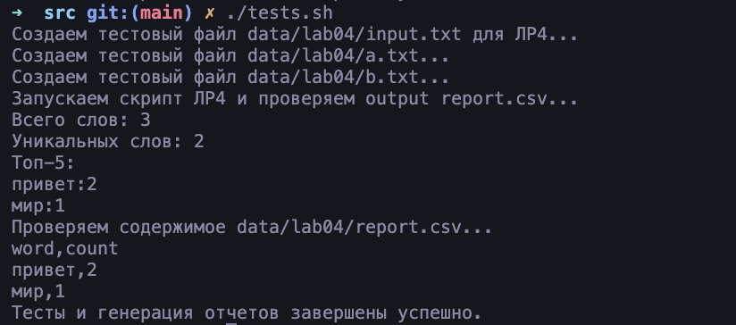

# Лабораторная работа № 4

## Коллекции и матрицы (list/tuple/set/dict)


io_txt_to_csv.py
```python
from pathlib import Path
import csv
from typing import Iterable, Sequence

def read_text(path: str | Path, encoding: str = "utf-8") -> str:
    """
    Прочитать весь текст из файла с заданной кодировкой (UTF-8 по умолчанию)
    Если нужно, укажите другую кодировку, например, encoding="cp1251"
    Исключения FileNotFoundError и UnicodeDecodeError не подавляются
    """
    p = Path(path)
    return p.read_text(encoding=encoding)

def write_csv(rows: list[tuple | list], path: str | Path,
              header: tuple[str, ...] | None = None) -> None:
    """
    Записать строки в CSV-файл с разделителем запятой
    Если указан header, он записывается первой строкой
    Проверяет одинаковую длину всех строк, иначе вызывает ValueError
    Создаёт/перезаписывает файл
    """
    if not rows and header is None:
        # Пустой файл
        with open(path, "w", encoding="utf-8", newline="") as f:
            pass
        return
    if rows:
        length = len(rows[0])
        for i, row in enumerate(rows):
            if len(row) != length:
                raise ValueError(f"Row {i} length {len(row)} != first row length {length}")
    p = Path(path)
    ensure_parent_dir(p)
    with p.open("w", encoding="utf-8", newline="") as f:
        writer = csv.writer(f)
        if header:
            writer.writerow(header)
        writer.writerows(rows)

def ensure_parent_dir(path: str | Path) -> None:
    """Создать родительские директории для файла, если их нет"""
    p = Path(path)
    if parent := p.parent:
        parent.mkdir(parents=True, exist_ok=True)
```

text_report.py
```python
import sys
import argparse
from collections import Counter
from lib.text import normalize, tokenize, count_freq, top_n
from io_txt_to_csv import read_text, write_csv

def frequencies_from_text(text: str) -> dict[str, int]:
    tokens = tokenize(normalize(text))
    return Counter(tokens)

def sorted_word_counts(freq: dict[str, int]) -> list[tuple[str, int]]:
    return sorted(freq.items(), key=lambda kv: (-kv[1], kv[0]))

def main():
    parser = argparse.ArgumentParser(description="Счётчик частот слов из текстового файла с выводом в CSV.")
    parser.add_argument("--in", dest="input_path", default="../data/input.txt",
                        help="Входной текстовый файл")
    parser.add_argument("--out", dest="output_path", default="../data/report.csv",
                        help="Путь для CSV отчёта")
    parser.add_argument("--encoding", default="utf-8",
                        help="Кодировка входного файла (по умолчанию utf-8)")
    args = parser.parse_args()

    try:
        text = read_text(args.input_path, encoding=args.encoding)
    except FileNotFoundError:
        print(f"Ошибка: файл {args.input_path} не найден.", file=sys.stderr)
        sys.exit(1)
    except UnicodeDecodeError:
        print(f"Ошибка: не удалось декодировать файл {args.input_path} с кодировкой {args.encoding}.", file=sys.stderr)
        sys.exit(1)

    freq = frequencies_from_text(text)
    sorted_freq = sorted_word_counts(freq)

    total_words = sum(freq.values())
    unique_words = len(freq)

    # Запись CSV с заголовком
    write_csv(sorted_freq, args.output_path, header=("word", "count"))

    # Вывод в консоль краткого отчёта, включая топ-5
    print(f"Всего слов: {total_words}")
    print(f"Уникальных слов: {unique_words}")
    print("Топ-5:")
    for word, count in top_n(freq, 5):
        print(f"{word}:{count}")

if __name__ == "__main__":
    main()
```

Тесты запускаются скриптом tests.sh:
```bash
#!/bin/bash
set -e

echo "Создаем тестовый файл data/lab04/input.txt для ЛР4..."
cat > ../data/lab04/input.txt << EOF
Привет, мир! Привет!!! 🏧 🚮
EOF

echo "Создаем тестовый файл data/lab04/a.txt..."
cat > ../data/lab04/a.txt << EOF
Привет мир
EOF

echo "Создаем тестовый файл data/lab04/b.txt..."
cat > ../data/lab04/b.txt << EOF
Привет, привет!
EOF

echo "Запускаем скрипт ЛР4 и проверяем output report.csv..."
python3 text_report.py --in ../data/lab04/input.txt --out ../data/lab04/report.csv

echo "Проверяем содержимое data/lab04/report.csv..."
head -n 10 ../data/lab04/report.csv

echo "Тесты и генерация отчетов завершены успешно."
```


## Лицензия <a name="license"></a>

[](https://creativecommons.org/licenses/by-nc-sa/4.0/)
Проект доступен с открытым исходным кодом на условиях [Лицензии CC BY-NC-SA 4.0](./LICENSE).

_Авторские права 2025 Андрей Казарин_
